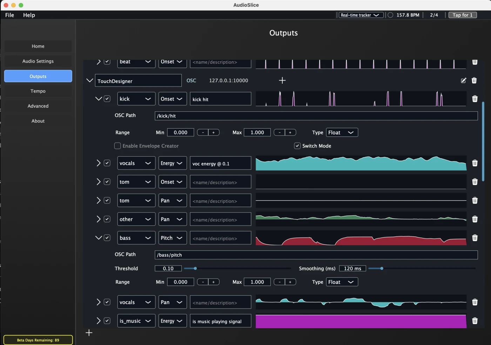
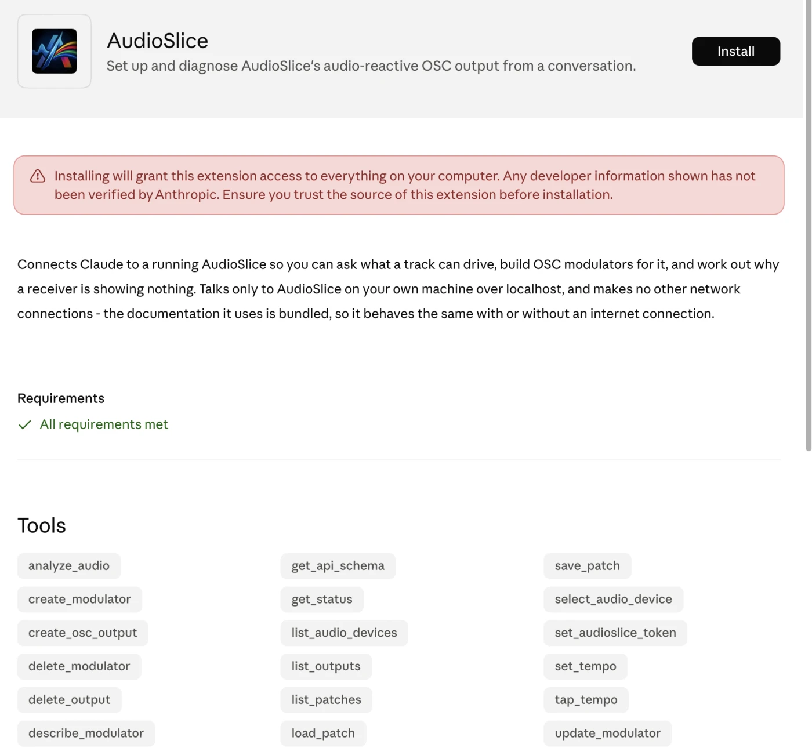
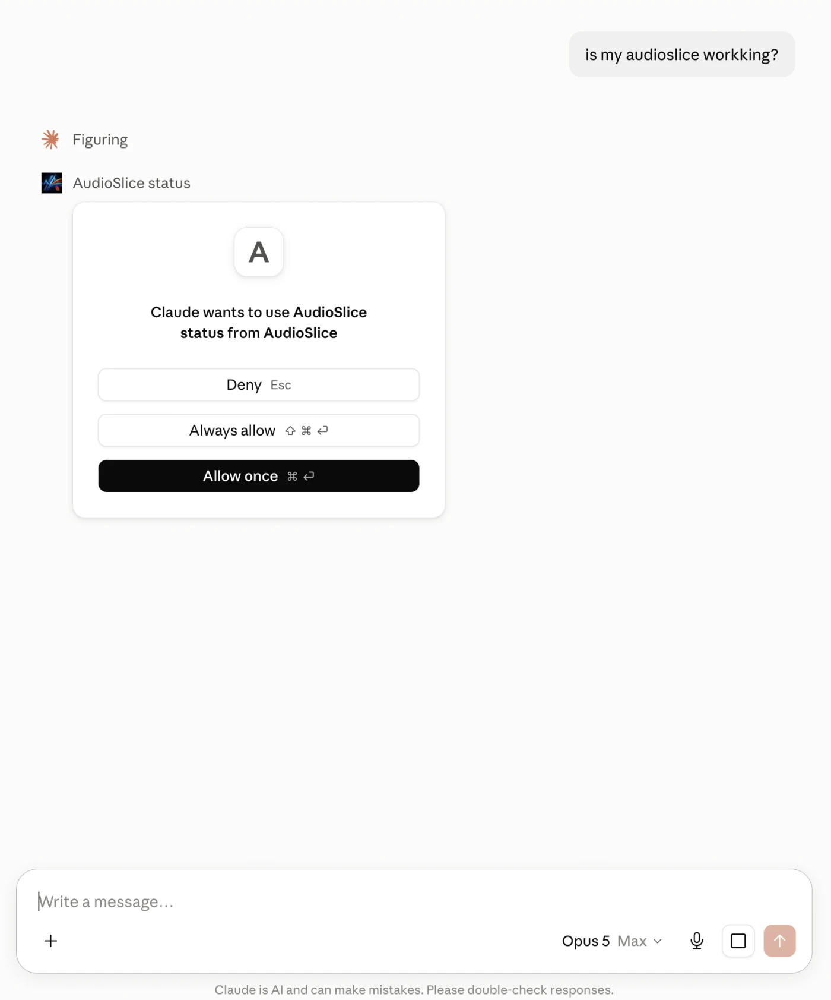
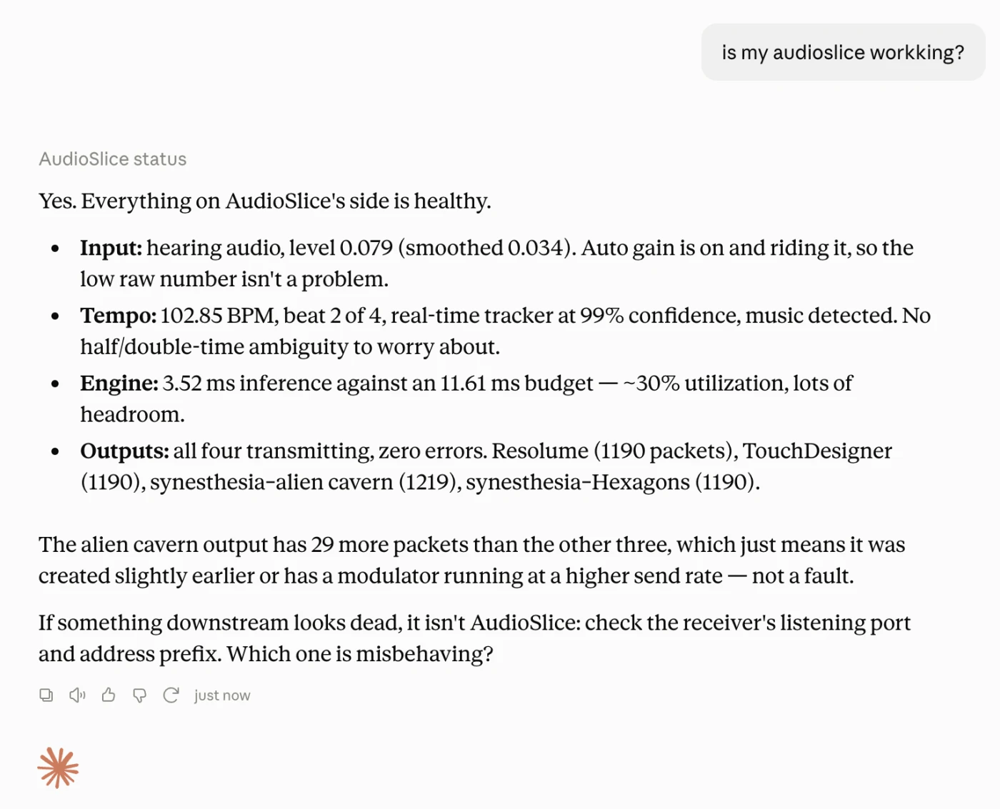

# AudioSlice MCP server

Connects Claude to a running [AudioSlice](https://vjlab.ai/docs/), so you can ask what a track can drive,
build OSC modulators for it, and work out why a receiver is showing nothing.

Read more about using the MCP in the [documentation](https://vjlab.ai/docs/audioslice/mcp).

## Install

1. Download **[audioslice-mcp.mcpb][latest]** — always the current release.
2. Double-click it, and accept the permissions prompt.
3. Open AudioSlice and play some music.
4. Ask Claude whether AudioSlice is set up correctly.

[latest]: https://github.com/vjlab-ai/audioslice-mcp/releases/latest/download/audioslice-mcp.mcpb

